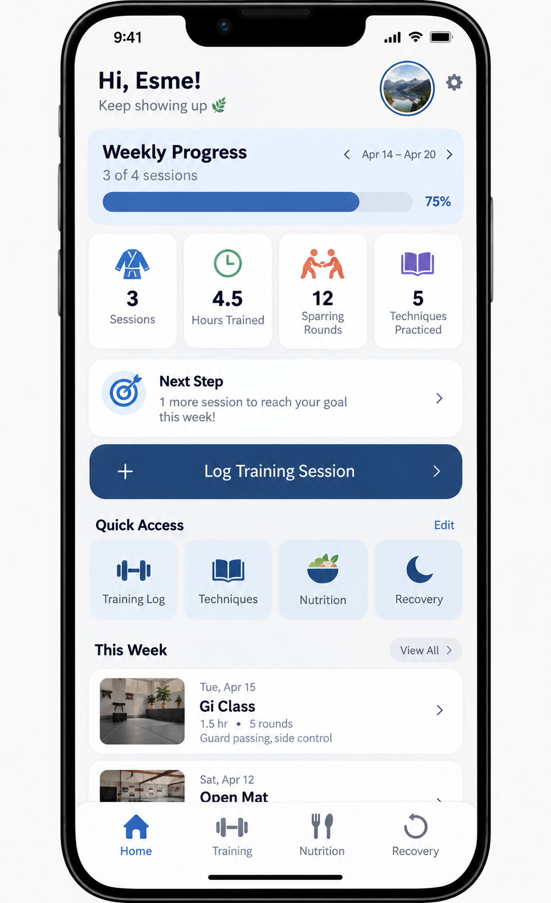
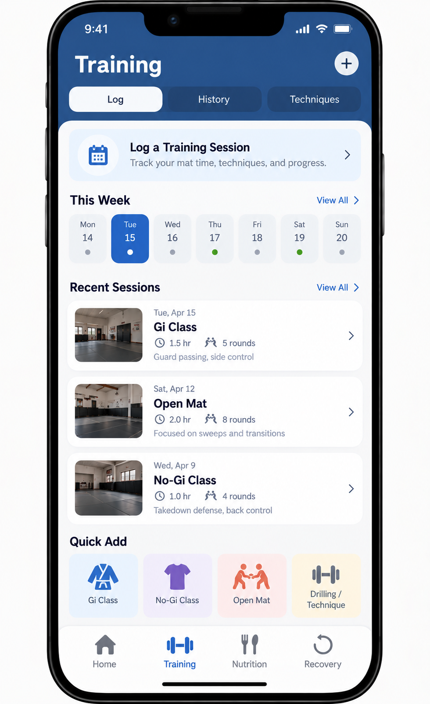
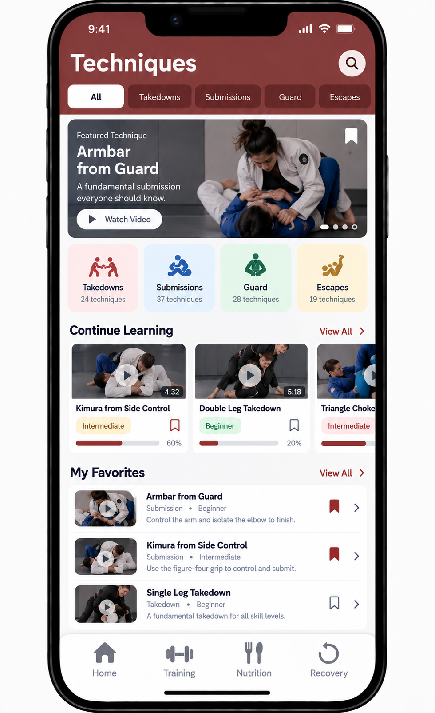
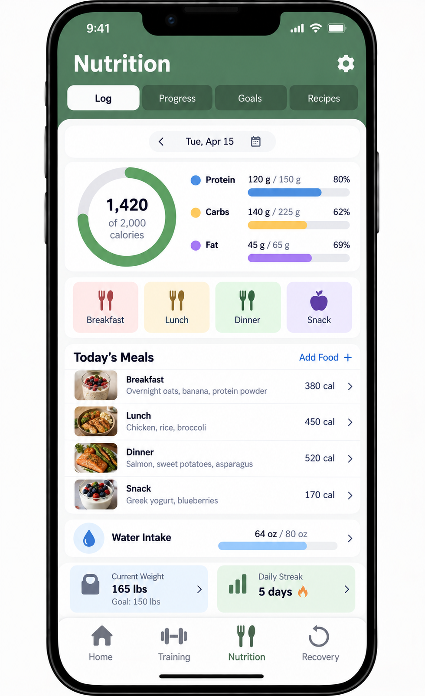
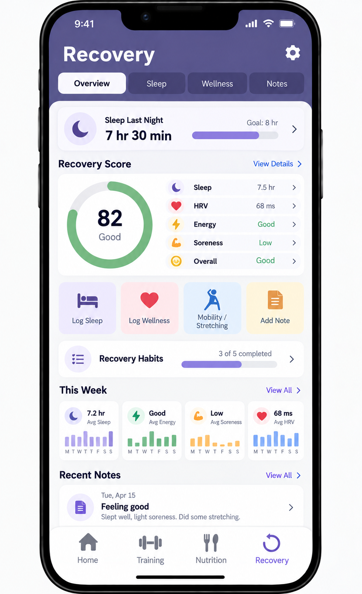

# Application UI Mockups

This folder contains preliminary user interface mockups for the BJJ Fitness App. 
These images are intended to provide an early visual representation of the 
application's layout, navigation, and major features.

### Home Dashboard

The Home Dashboard provides users with a quick overview of their weekly BJJ 
training progress. It includes information such as sessions completed, hours 
trained, sparring rounds, techniques practiced, and progress toward the user's 
weekly training goal.

### Training

The Training screen allows users to log and review BJJ training sessions. 
Training sessions may include the date and time, duration, techniques practiced, 
sparring information, and session notes.

### Techniques

The Techniques screen provides access to the application's BJJ technique 
library. Techniques can be organized into categories such as takedowns, 
submissions, guard techniques, and escapes. Individual techniques may include 
descriptions, difficulty levels, and instructional resources.

### Nutrition

The Nutrition screen is designed to help users manage fitness and nutrition 
goals. It provides a place to track calories, macronutrients, meals, water 
intake, and weight-related goals.

### Recovery

The Recovery screen provides users with a way to track factors related to 
recovery and readiness for training, including sleep, energy levels, soreness, 
mobility, and recovery notes.

